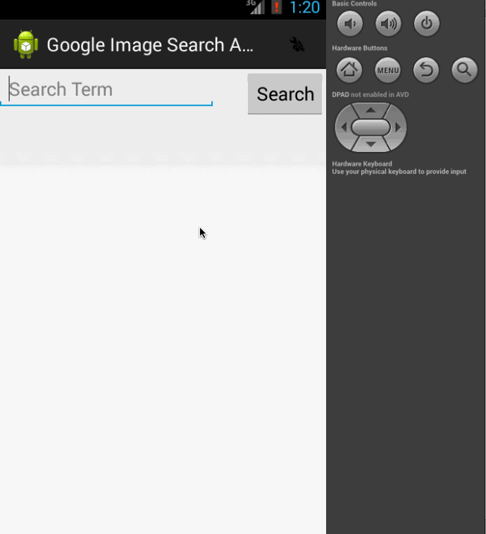

# GoogleImage Search Image

Google Image Search Demo which uses Google Image Search API and Modal Dialog

Time spent: 10 hours spent in total

Completed user stories:

 * [x] Complete infinite scrolling, filtering
 * [x] Optional: Used DialogFragment
 
Notes:

I was trying to get include the email and trying to opening the webpage using browser where the Image belongs to, still need to complete that will work on those. 
Spent quite a bit time in the layout and getting ArrayAdapter for Spinner work, still there is a bug in the demo where by default the an Item gets selected, need to fix that issue. 

Walkthrough of all user stories:

GIF created with [LiceCap](http://www.cockos.com/licecap/).
