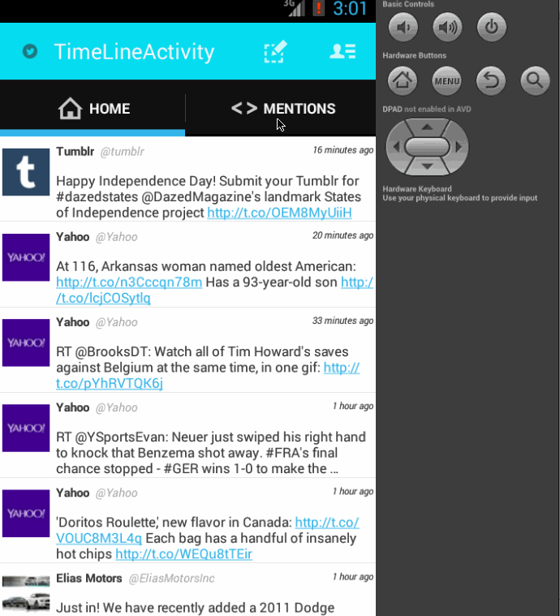

# Twitter Tweet App

Google Image Search Demo which uses Google Image Search API and Modal Dialog

Time spent: 10 hours spent in total

Completed user stories:

 * [x] Complete infinite scrolling, timeline with formatted time, posting the tweet 
 * [x] Fragments Implementation for Homeline, Tweets and User Profile
 * [x] Infinite Scrolling
 * [x] Tabs Impl
 
Notes:

Walkthrough of all user stories:

GIF created with [LiceCap](http://www.cockos.com/licecap/).
