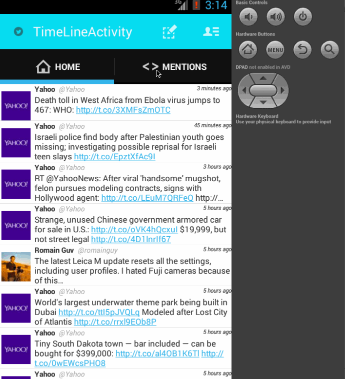

# Twitter Tweet App

Google Image Search Demo which uses Google Image Search API and Modal Dialog

Time spent: 10 hours spent in total

Completed user stories:

 * [x] Complete infinite scrolling, timeline with formatted time, posting the tweet 
 * [x] Optional: Used DialogFragment
 
Notes:

Still the posted tweet is not yet posted on the timeline activity, there is a problem while getting my user details, that has to be fixed. 

Walkthrough of all user stories:

GIF created with [LiceCap](http://www.cockos.com/licecap/).
